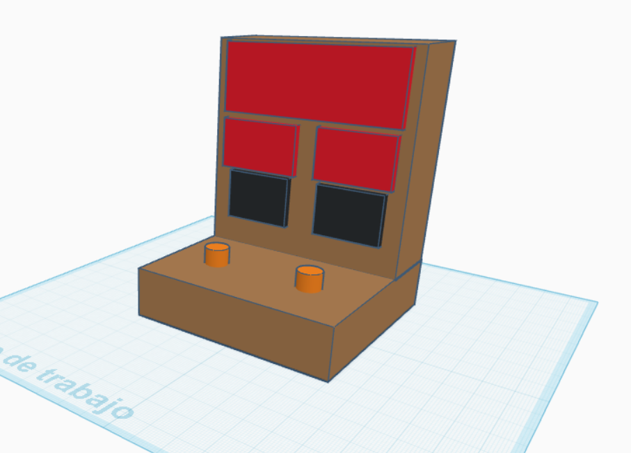
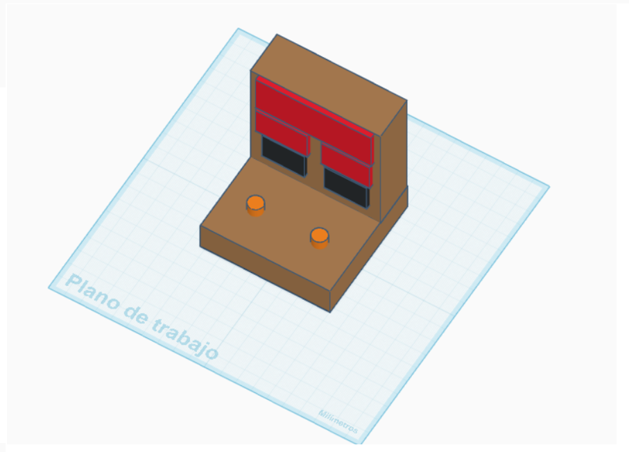
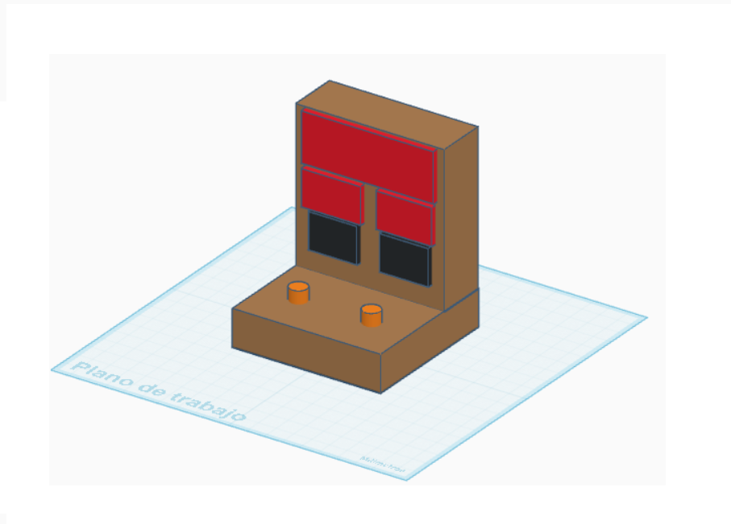
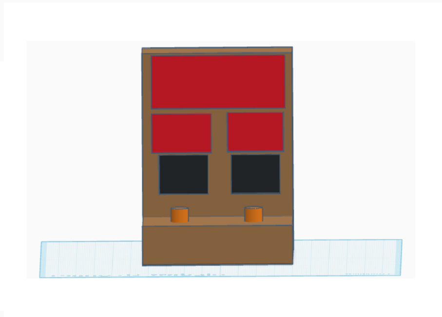
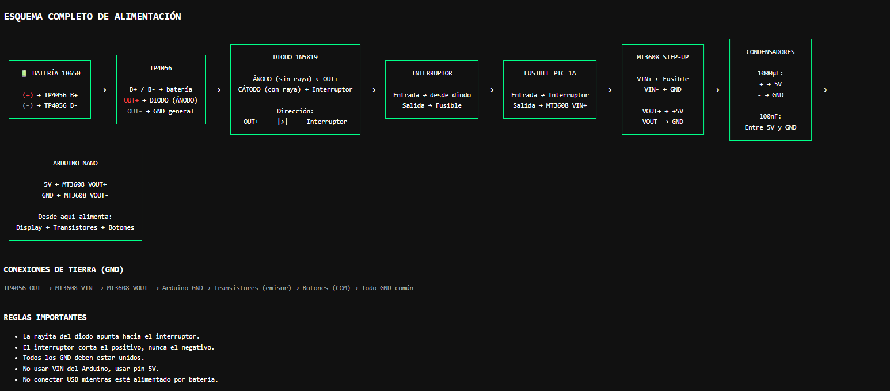

# 🔢 Contador Doble de 2 Dígitos con Arduino (7 Segmentos Multiplexados)

Proyecto electrónico basado en Arduino que implementa **dos contadores independientes (00–99)** usando **4 displays de 7 segmentos construidos con LEDs individuales**, controlados mediante multiplexado.

El sistema funciona con **batería 18650 recargable**, incluye regulación de voltaje y control por botones.

---

## ✨ Características

- 🔢 Dos contadores independientes (00–99)
- 💡 Displays de 7 segmentos hechos con LEDs individuales
- ⚡ Multiplexado para reducir pines
- 🎛️ Control mediante dos pulsadores
- 🔋 Alimentación portátil con batería 18650
- 🔧 Regulador Step-Up a 5V
- 🪫 Bajo consumo energético
- 🚫 Código optimizado para evitar ghosting

---

## 🎨 Diseño

<table align="center">
  <tr >
    <td></td>
    <td></td>
      <td></td>
      <td></td>
  </tr>
</table>

---

## ⚙️ Funcionamiento

El sistema usa **multiplexado de displays**, lo que permite controlar 4 dígitos usando:

- 7 pines para segmentos  
- 4 pines para selección de dígitos  

Cada botón incrementa un contador independiente:

- 🔘 Botón A → contador izquierdo  
- 🔘 Botón B → contador derecho  

---

## 📌 Distribución de pines

### Segmentos

| Segmento | Pin Arduino |
|----------|-------------|
| A | D7 |
| B | D4 |
| C | D2 |
| D | D6 |
| E | D8 |
| F | D3 |
| G | D5 |

---

### Dígitos

| Dígito | Pin Arduino |
|--------|-------------|
| D1 | D12 |
| D2 | D11 |
| D3 | D10 |
| D4 | D9 |

---

### Botones

| Botón | Pin |
|------|-----|
| A | A4 |
| B | A2 |

---

## 🔋 Alimentación

El sistema funciona con:

1. 🔋 Batería 18650 (3.7V)  
2. 🔌 TP4056 para carga  
3. ⚡ MT3608 ajustado a 5V  
4. 🧠 Salida regulada al Arduino Nano  

---

## 🧠 Estructura del código

- Lectura de botones con antirrebote  
- Tabla de números 7 segmentos  
- Mapeo de segmentos configurable  
- Multiplexado optimizado  
- Corrección de ghosting  

---

## 🚀 Mejoras futuras

- 🌗 Control de brillo por PWM  
- 💾 Guardado de contadores en EEPROM  
- 🖥️ Pantalla OLED opcional  
- 📊 Indicador de batería digital  

---

---

## 👨‍💻 Autor

Proyecto desarrollado por **GuillerGU24**